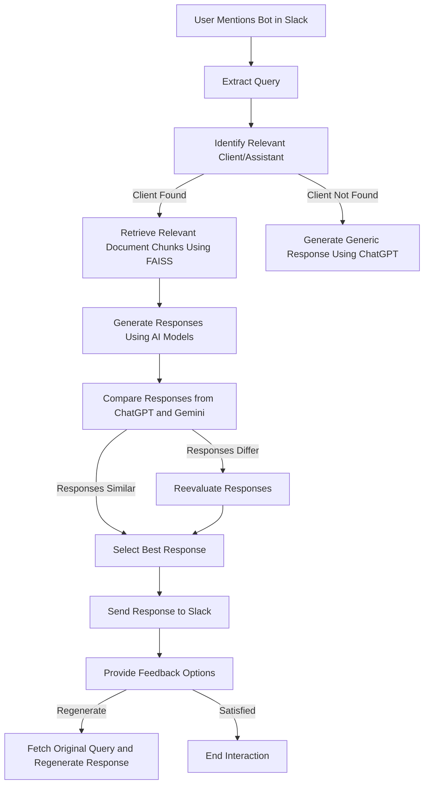

# How It Works: Flowchart

Below is a flowchart representation of how the Slack bot processes user queries and generates responses.

## Explanation of the Flowchart

1. **User Mentions Bot**:
   - The process begins when a user mentions the bot in a Slack channel with a query.

2. **Extract Query**:
   - The bot extracts the query text from the Slack message.

3. **Identify Relevant Client/Assistant**:
   - The bot determines the relevant client or assistant based on the query. If no client is found, it generates a generic response.

4. **Retrieve Document Chunks**:
   - If a client is identified, the bot retrieves relevant document chunks using FAISS.

5. **Generate Responses**:
   - The bot generates responses using OpenAI's ChatGPT and Google's Gemini models.

6. **Compare Responses**:
   - The bot compares the responses from both models. If they are similar, it selects the best response. If they differ, it reevaluates the responses.

7. **Send Response**:
   - The bot sends the selected response back to the Slack channel.

8. **Provide Feedback Options**:
   - The bot provides interactive buttons for feedback, allowing users to regenerate the response or indicate satisfaction.

9. **Regenerate Response**:
   - If the user requests regeneration, the bot fetches the original query and generates a new response.

10. **End Interaction**:
    - If the user is satisfied, the interaction ends.

This flowchart provides a clear and structured view of the bot's workflow, making it easier to understand its functionality.
